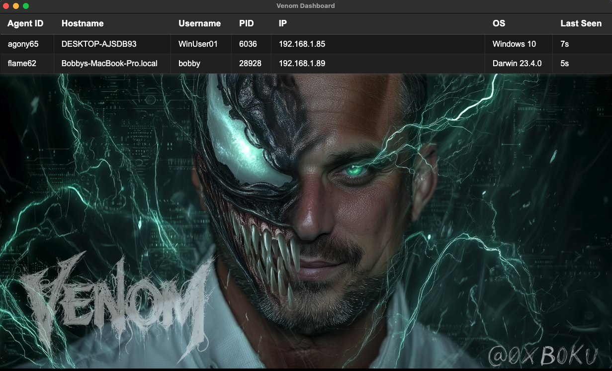

# Venom C2 



Venom C2 is a dependency‑free Python3 Command & Control framework for redteam persistence, built to run on systems without installing packages. It comprises a Flask team server, an Electron operator GUI, and a single‑file Python agent that communicates over HTTP/HTTPS using configurable AES‑encrypted JSON messages. Use it to execute commands, manage files, maintain access, and create SSH reverse tunnels from compromised systems.


## Background

While escalating network privileges we landed on many production systems running exotic distros and architectures. We wanted to set up persistence, but our arsenal of tools and techniques did not work. Additionally, some of the target systems were running EDR. 

These were production systems, so we did not want to install packages. We needed a C2 agent that would run without dependencies. The systems had Python3 installed, so I created Venom C2 mid-engagement; a dependency‑free Python3 C2 agent that just works. 

We didn't want to use off‑the‑shelf C2 agents because of the risk that they could result in detection by the blue team. 
_Unique code is king for bypassing modern day EDRs_

Since there were many systems, we automated unique obfuscation, naming, filesystem placement, different network callback domains, and unique network path requests per agent.


_I named it `Venom` because my son loves the Venom villian from Spider-Man. Plus python is a snake, so it felt like it was a good fit._


## Venom C2 Future
_There isn't one._

This was just a one-off C2 project I did mid-engagement. It took about 2 days of dev to get it stable and reliable in the target environment. It did its job, gave us persistence in the network for the remaining 6 weeks of the engagement. I don't have any plans to continue developing or using this project, so I figured its a good candidate to release publically. 

Otherwise it would just be lost to the _devNULL..._


## Venom C2 Components & Features
### Server
- Python3 Flask 
- Team server supporting multiple operators
- Saves command history
- Script for configuring agents 
- Script for obfuscating agents
- Manages agent connections 
- API for communicating with the GUI client
- Custom profiles with random selection from large arrays of:
  - C2 message parameter names
  - Random headers
  - Random JSON attributes with scalable value types 
### Client GUI 
- Electron 
- Works on Linux, macOS, Windows
- GUI is a slimmed down version of the Loki GUI
### Agent 

- Python3 without dependencies
- Messages are encrypted using configurable AES keys
- All messages are sent as JSON POST requests
- Custom profiles with random selection from large arrays of:
  - URI base paths (useful for setting up reverse proxy routing)
  - Multiple URI paths for each agent function
  - C2 message parameter names
  - User agents
  - Random headers
  - Random JSON attributes with scalable value types 

## Agent Commands

[11-04-2025 11:31 AM MST] admin help

```
help     : Display this help menu
ls       : List directory contents
pwd      : Show current working directory
cd       : Change directory
cat      : Display file contents
mv       : Move/rename files or directories
cp       : Copy files or directories
mkdir    : Create directory
rmdir    : Remove empty directory
write    : Write content to file
chmod    : Change file permissions
rm       : Remove (delete) files
shell    : Execute raw shell command
sleep    : Make agent sleep with optional jitter
sshrev   : Create reverse SSH tunnel
kill     : Terminate agent process
upload   : Upload a file from your local operator box to the remote agent box
download : Download a file from remote agent box to local operator box
```

## Quick Start

### 1. Get the code on your server

```bash
git clone https://github.com/boku7/venom 
cd venom
```

### 2. Install server requirements (Python 3)

```bash
pip3 install -r server/requirements.txt
```

### 3. Run the server

```bash
cd server
python3 server.py --help
python3 server.py
```

- First start generates admin username and password printed to the console. Copy and store to authenticate client to server.
- Or set your own: `python3 server.py --adduser <USERNAME> <PASSWORD>`

### 4. Run Client on Workstation

Run the client UI on your workstation (not the server). It must reach the server.

```bash
cd ../client
npm install
npm run start
```

Open the client, go to Config, and enter the server credentials. 

#### Security 
The server’s client API base path is `/api/`. Do not expose `/api/` to the public internet. Use VPN or strict firewall/reverse-proxy rules so only trusted clients can reach it.

### 5. Create Agent

From the `server` directory:

```bash
python3 agent_create.py -H <server_host> -P <server_port> [-http]
```

### 6. Obfuscate Agent

From the `server` directory:

```bash
python3 agent_obfuscate.py agents/<generated_agent_file>.py
```

### 7. Run Agent
To be ran on target computer you want to control.
```bash
python3 /Users/bobby/venom/server/obfuscate/output/obfuscated_agent_20251104_110902.py
```
